## \[Archive\] Art Portfolio
**Disclaimer:** This is a backup of my undergraduate art portfolio. I may upload more recent work soon.

---

Exhibition photos

---  

## You're Welcome (2019)

**Materials:** pen, paper, bench, rejected sketches, shelf, sketchbook, video and audio recording  
**Dimensions:** 10 minutes video

**Artist statement:** I want to let go of the idea that I can control what others think about me. I often find myself speculating about what other people’s expectations and judgments will be when I work, attaching my self-worth to other’s positive reactions. This often leaves me feeling too afraid of negative judgment to feel comfortable enough to share my work. By drawing in public spaces, I seek to confront this construction of my identity and worth that is based on other people’s perceptions. Potentially having people look over my shoulder or comment on my work forces me to overcome my doubt, by denying me the option to hide. In order to stop myself from doing the compulsive work of guessing, I will give my work away and record other’s responses to my work as a way to replace my anticipation. If my sketches are rejected they are shown on a reject pile in the gallery. Alongside the sketchbook and rejected sketches, I am showing a video of my process including recordings of responses to my sketches. Through this way of working, I hope to explore a sense of self that exists under my worry and doubt about what I can safely share.

Video available at: https://watzek.lclark.edu/seniorprojects/items/show/1142

---

## EDGE DETECTION EXPERIMENT 1 (2018)

  
 
  

**Materials:** Cell Image Library, Acrylic sheets, Molotow One4All Markers, cardboard  
**Dimensions:** 7 layers,  8 inches x 10.5 inches each

I performed an edge detection algorithm by applying an edge detection filter to an image of a neuron from the Cell Image Library. This process is usually carried out by a computer and requires mathematical operations, however, I was curious if I could get a sensible result if I performed the algorithm manually. In order to express different mathematical values I used white, black and different gray markers. I also created transparent filters that I could slide over the original image.

---

## EDGE DETECTION EXPERIMENT 2 (2018)

 

**Materials:** Photo of my hand, Acrylic sheets, Molotow One4All Markers
**Dimensions:** 1 photo and 3 layers of 18'' x 24'' drawings

The process of creating this piece was similar to the process used for Edge Detection Experiments 1. I took a photo of my hand (palm) and applied an edge detection filter to it. I used 4 markers, each representing a different number (2: black 1: dark gray -1: light gray -2: white), and created two convolutional layers on transparent acrylic sheets. To divide the image into “pixels”, I placed a grid of 2×2 inches squares below the transparent sheets. One layer was created by sliding the filter (a 3×3 matrix) across the image horizontally and the second one by sliding it across vertically. I then placed these two layers on top of each other to create the final layer for which I only used black and white dots (by visually determining if more black or white dots were present at each pixel location). 

---

## Quickdraw Experiment (2018)

 
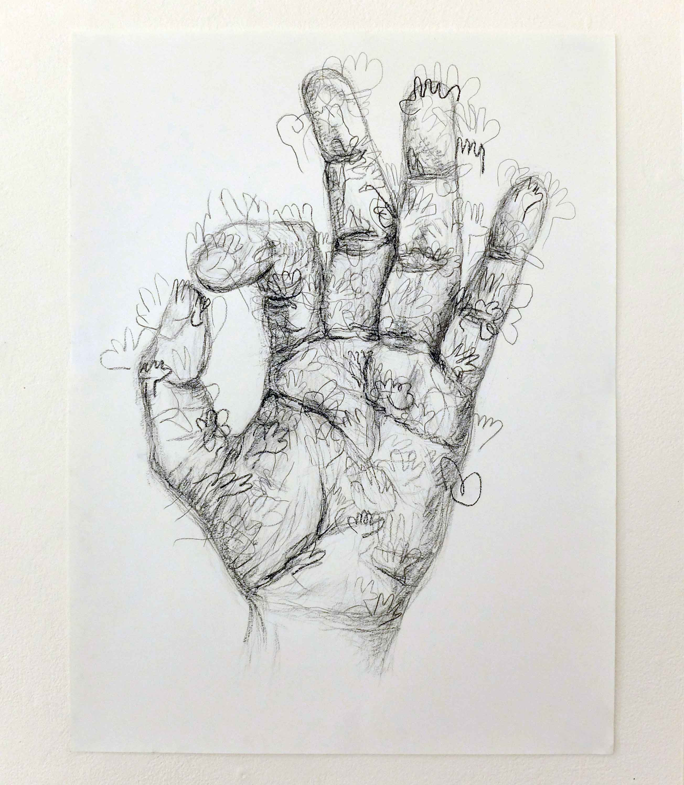
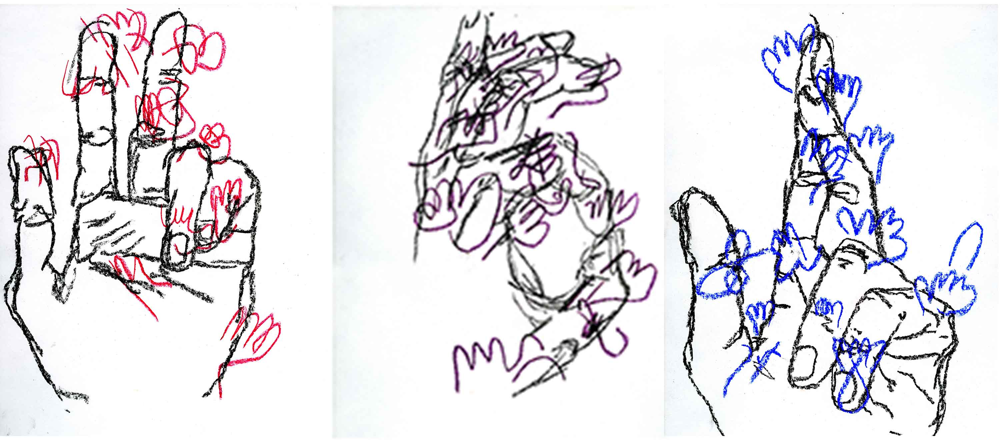
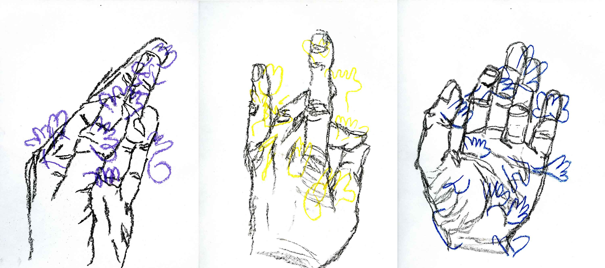
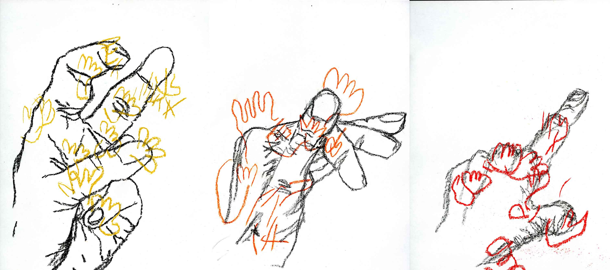
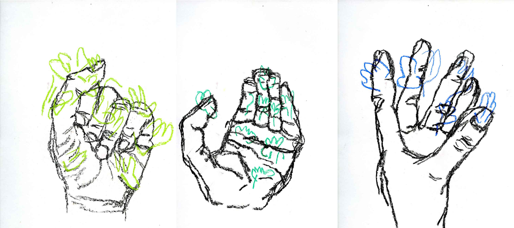

**Material:** Google QuickDraw Database, chalk, color pastels, paper
**Dimensions:** 12 drawings – 8'' x 10.5'', 1 drawing – 18'' x 24''

I drew my hand in different gestures in an iterative process while collaborating with the Google QuickDraw application. I only drew three lines at a time and provided these lines as an input for the Google QuickDraw network that was trained to draw hands. QuickDraw then completed the hand based on the lines it was given. I copied the drawing of the hand that was generated by QuickDraw onto my piece of paper and then continued the process by drawing the next few lines.

---

## A White Artwork (2018)

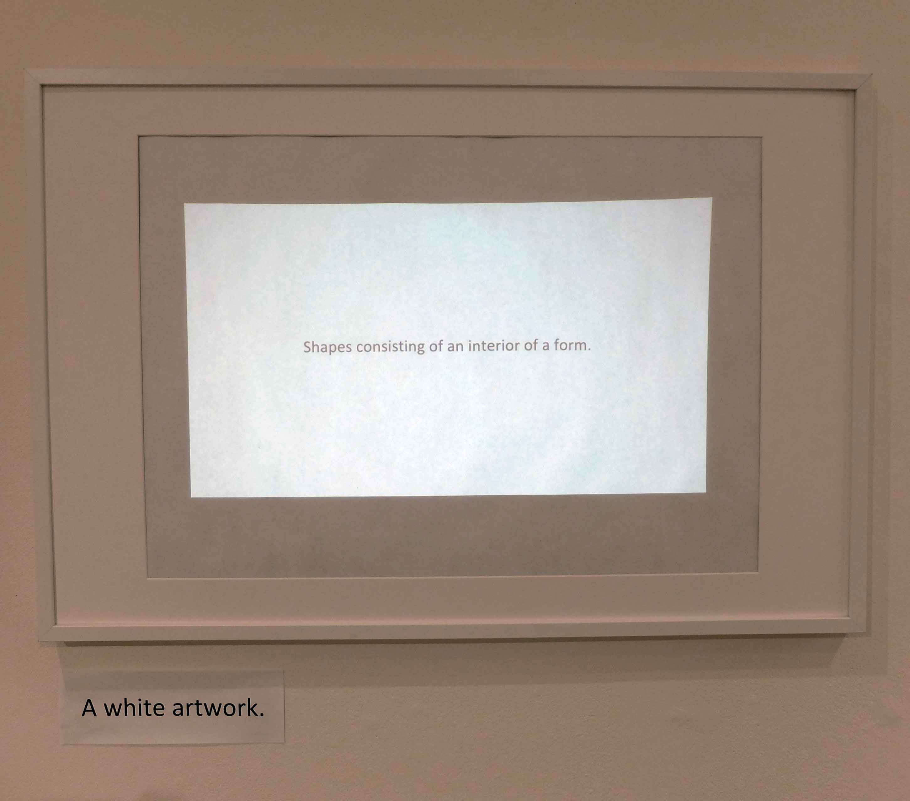

**Material:** LSTM network, Whitney.org/exhibitions/past alt text, sketch.js, R, frame, projector   
**Dimensions:** 1:30 min video

This project started out of my interest in how neural networks comprehend and learn about what makes art important to humans. Furthermore, I was curious what I would learn about art-making by visually translating descriptions of art generated by a neural network. In order to investigate, I scraped alternate text of images showing artwork on the Whitney Museum’s website. The alternate text is written by a person and describes the content of an image to make it accessible to anyone who can’t see the image. I then trained a LSTM artificial neural network on the text I collected and let it generate text in the same style, which I interpret as descriptions of new artwork. The video projected onto the empty frame shows some of the prompts that were generated. 

---

## A White Book (2018)

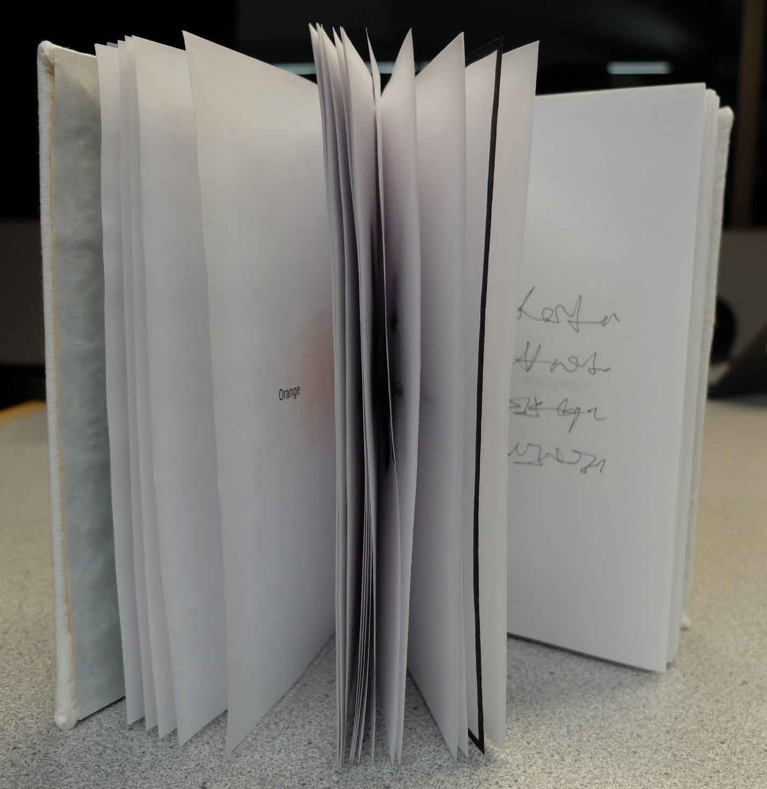
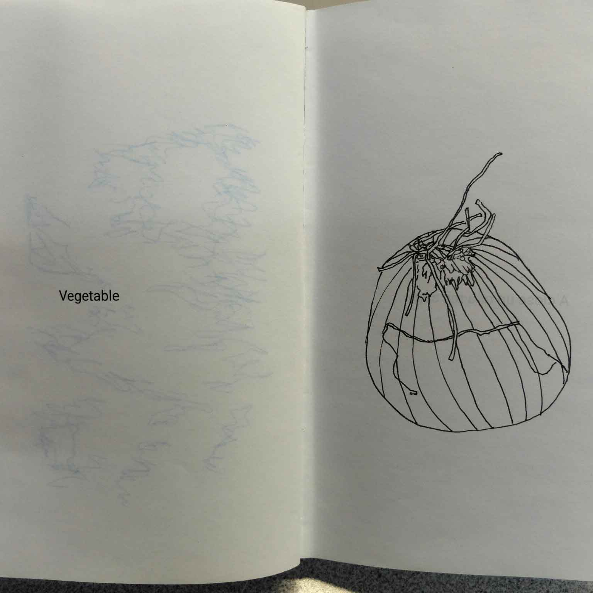
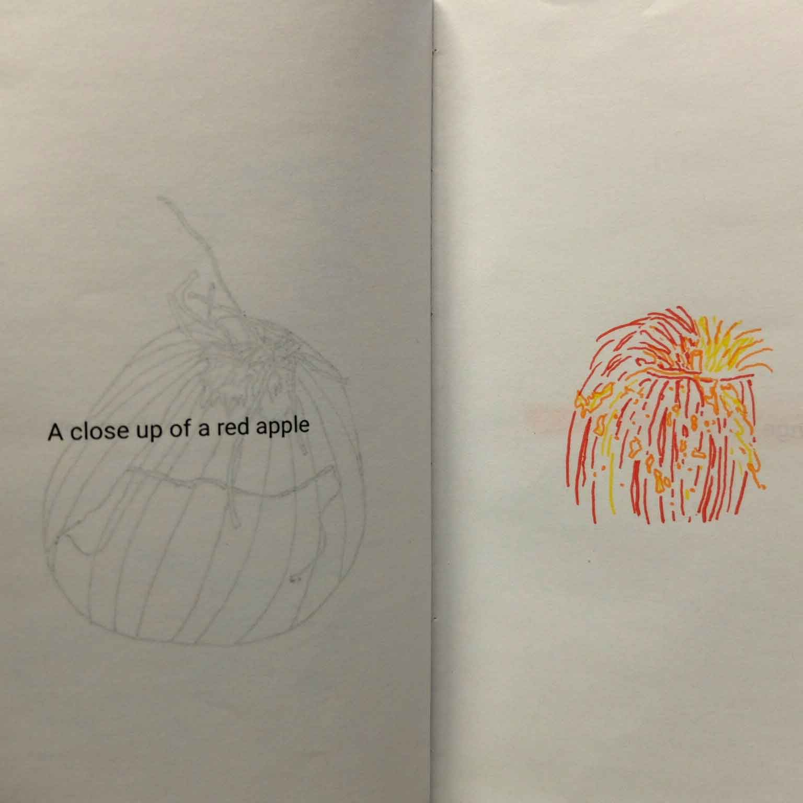
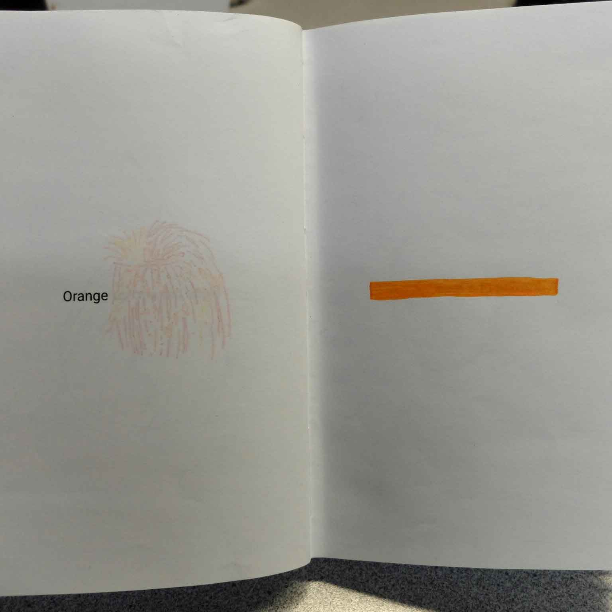

**Dimensions:** The book’s dimensions are 11.8'' (W) x 3.9'' (D) x 15.7'' (H)
**Materials:** printing paper, colored paper, glue, cardboard, white cloth for the cover, pencil, pens, and the Microsoft machine vision API. 

The following text on the first pages of the book explains the work to the viewer/reader:

This project started out of my interest in how neural networks comprehend and learn about what makes art important to humans. Furthermore, I was curious what I would learn about art-making by visually translating descriptions of art generated by a neural network. 
In order to investigate, I scraped alternate text of images showing artwork on the Whitney Museum’s website. The alternate text is written by a person and describes the content of an image to make it accessible to anyone who can’t see the image. I then trained an LSTM artificial neural network on the text I collected and let it generate text in the same style, which I interpret as descriptions of new artwork. These are some of the prompts it generated:

Painting of the surrounding of the street.
Shapes consisting of an interior of a form.
Painting of a horse.
Firm wall of a gas.
Lines and contrast and geometric painting.

After visually translating these prompts, I started playing a game. I took a photo of my work and used the Microsoft computer vision API to generate alternate text for the photo. How well did my translation work? Could a computer still recognize the original prompt? If the description was not the same as the prompt I was interpreting, then I used the new description to make another work for the next round. How imaginative or abstract can I get with the interpretation of a prompt, and how well can a computer keep up with my imagination?

I have done multiple iterations of this game, the rest of the book contains space for you to continue.

Instructions:

1) Identify the prompt on the last non-empty page 
2) Interpret the prompt on the opposite page
3) Take a photo of your work
4) Go to goo.gl/34w5z2 and submit the photo
5) Write the text generated in the description box on the next page (the back of the page your drawing is on)
6)   Repeat

If you receive the same description twice in a row, pick one of the prompts generated from the Whitney’s website and start again.

---

## ALL WE NEED IS LOVE كل ما تحتاجه هو الحب ♥ (2017)

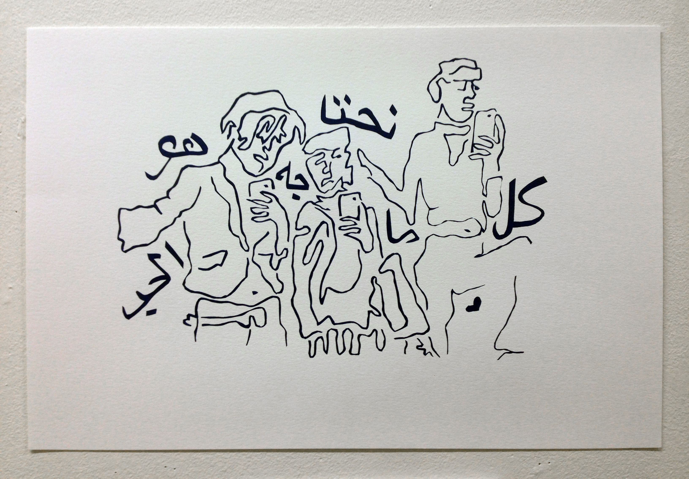

**Materials:** Screenprint on paper
**Dimensions:** 8.27'' x 11.69''
