## \[Archive\] Art Portfolio
**Disclaimer:** This is a backup of my undergraduate art portfolio. I may upload more recent work soon.
---
Exhibition photos

---  

## You're Welcome (2019)

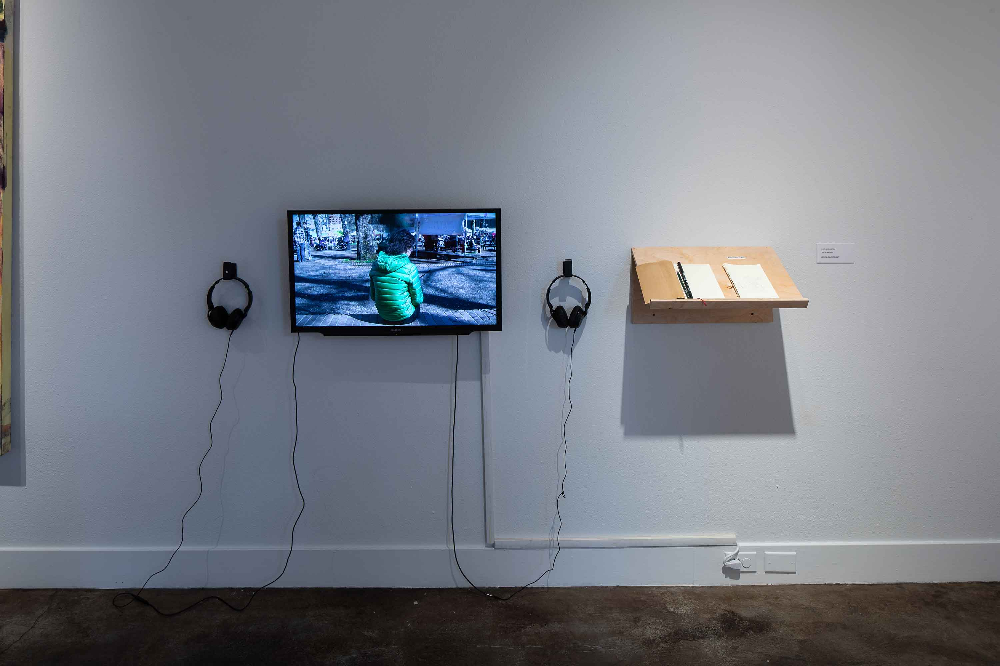
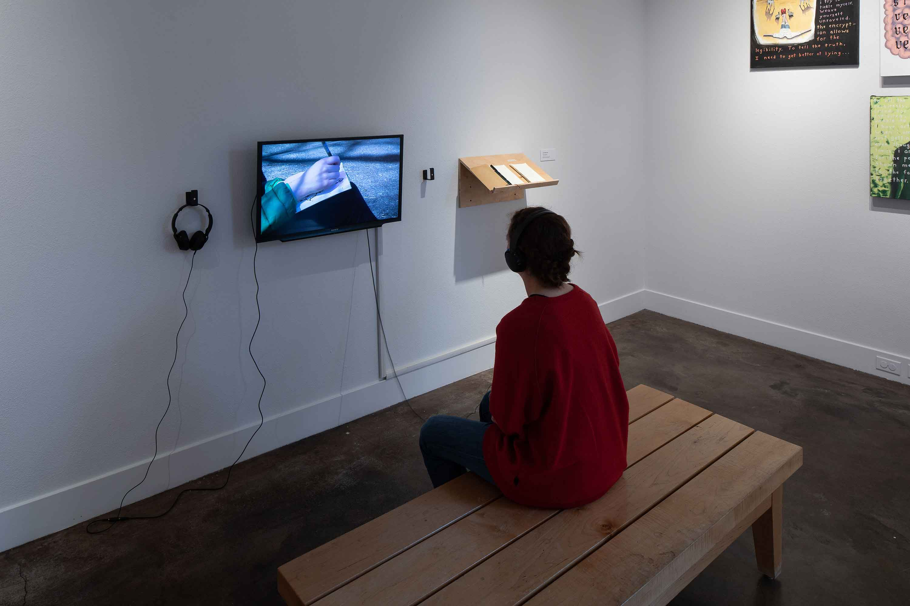

**Materials:** pen, paper, bench, rejected sketches, shelf, sketchbook, video and audio recording  
**Dimensions:** 10 minutes video

**Artist statement:** I want to let go of the idea that I can control what others think about me. I often find myself speculating about what other people’s expectations and judgments will be when I work, attaching my self-worth to other’s positive reactions. This often leaves me feeling too afraid of negative judgment to feel comfortable enough to share my work. By drawing in public spaces, I seek to confront this construction of my identity and worth that is based on other people’s perceptions. Potentially having people look over my shoulder or comment on my work forces me to overcome my doubt, by denying me the option to hide. In order to stop myself from doing the compulsive work of guessing, I will give my work away and record other’s responses to my work as a way to replace my anticipation. If my sketches are rejected they are shown on a reject pile in the gallery. Alongside the sketchbook and rejected sketches, I am showing a video of my process including recordings of responses to my sketches. Through this way of working, I hope to explore a sense of self that exists under my worry and doubt about what I can safely share.

Video available at: https://watzek.lclark.edu/seniorprojects/items/show/1142

---

## EDGE DETECTION EXPERIMENT 1 (2018)

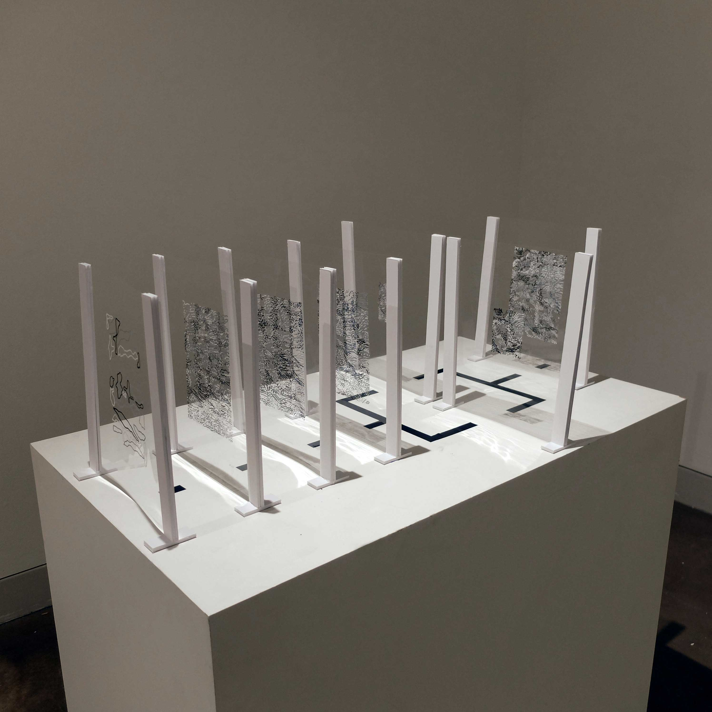  
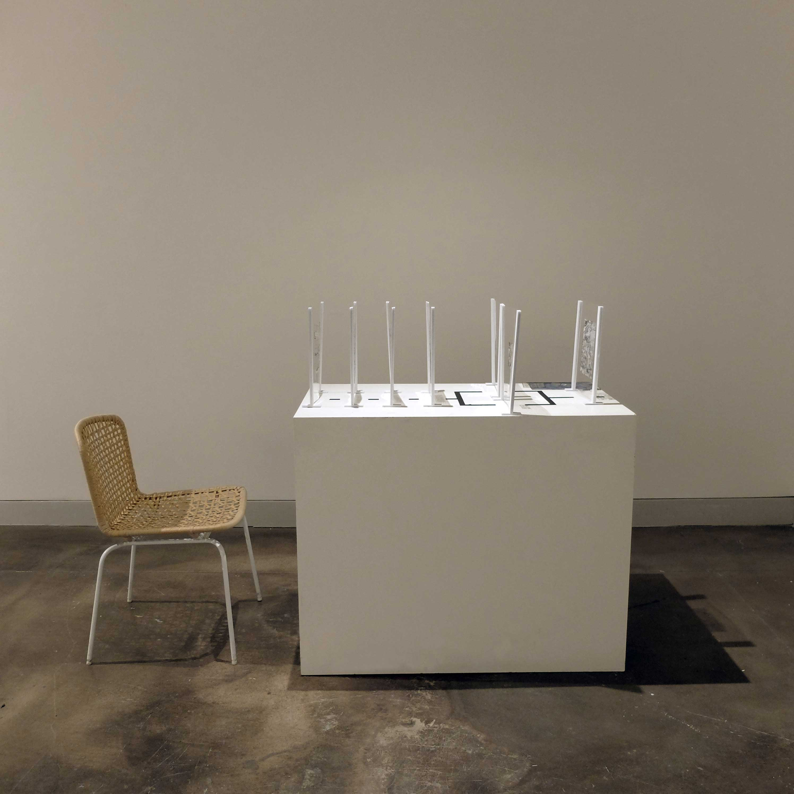 
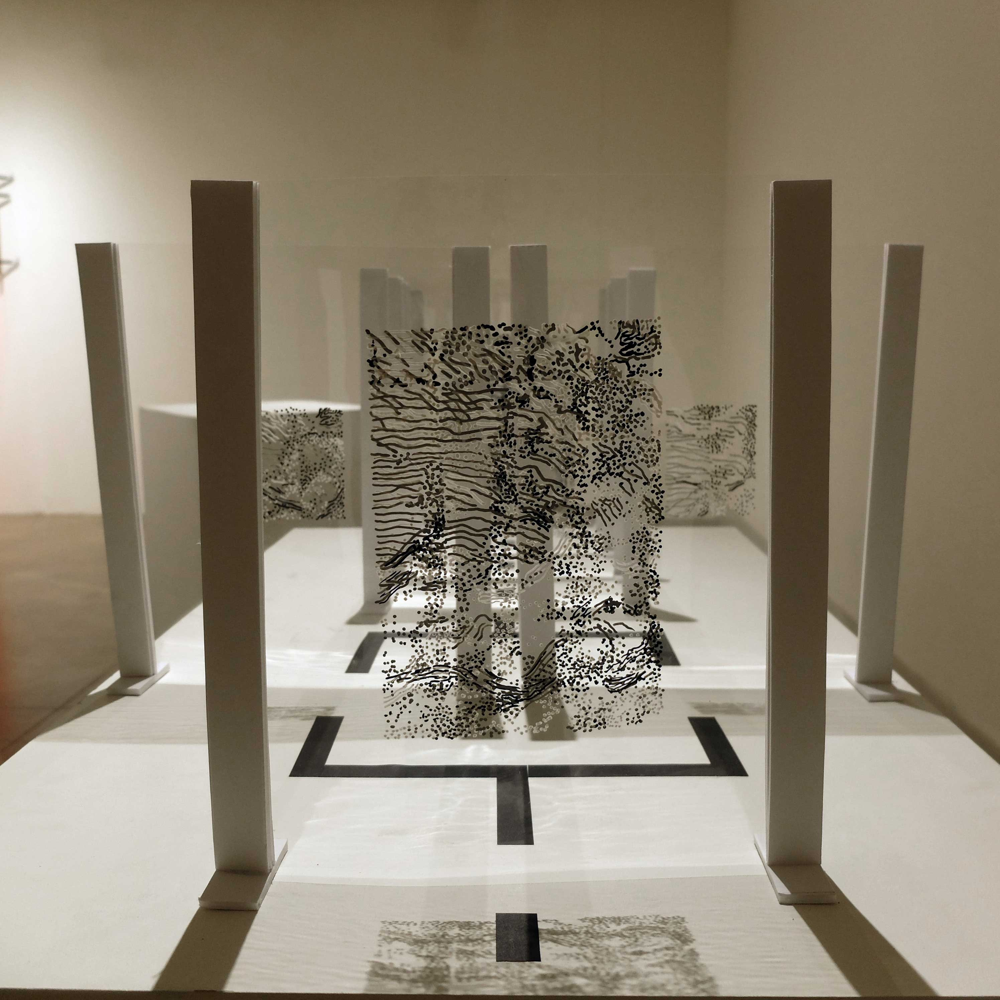  
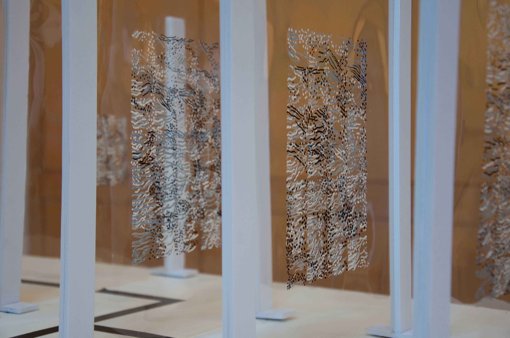
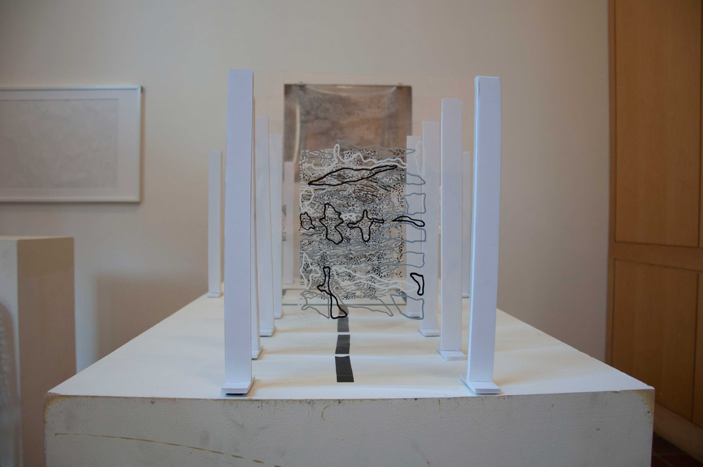

**Materials:** Cell Image Library, Acrylic sheets, Molotow One4All Markers, cardboard  

**Dimensions:** 7 layers,  8 inches x 10.5 inches each

I performed an edge detection algorithm by applying an edge detection filter to an image of a neuron from the Cell Image Library. This process is usually carried out by a computer and requires mathematical operations, however, I was curious if I could get a sensible result if I performed the algorithm manually. In order to express different mathematical values I used white, black and different gray markers. I also created transparent filters that I could slide over the original image.
---

## EDGE DETECTION EXPERIMENT 2 (2018)

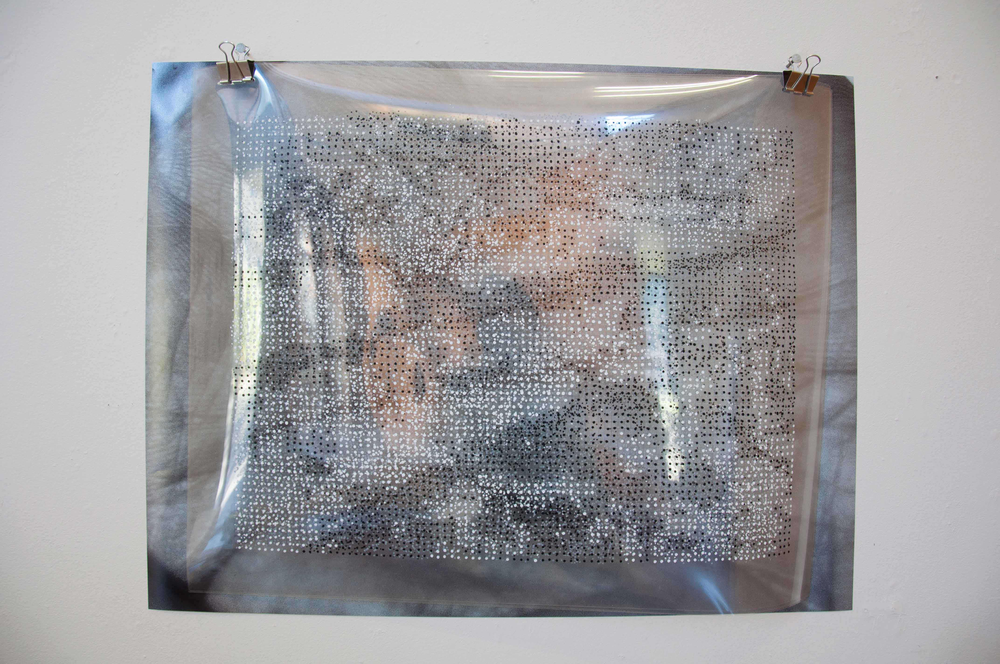 
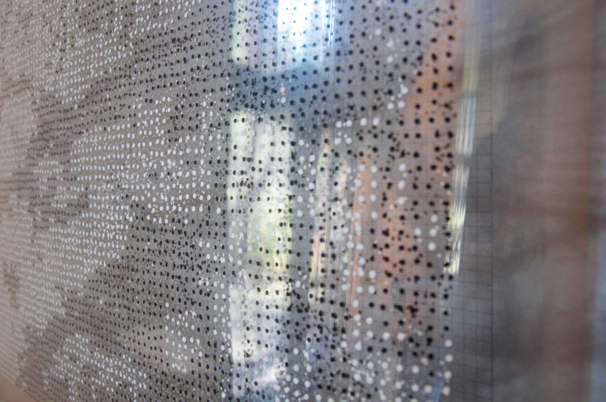

**Materials:** Photo of my hand, Acrylic sheets, Molotow One4All Markers
**Dimensions:** 1 photo and 3 layers of 18'' x 24'' drawings

The process of creating this piece was similar to the process used for Edge Detection Experiments 1. I took a photo of my hand (palm) and applied an edge detection filter to it. I used 4 markers, each representing a different number (2: black 1: dark gray -1: light gray -2: white), and created two convolutional layers on transparent acrylic sheets. To divide the image into “pixels”, I placed a grid of 2×2 inches squares below the transparent sheets. One layer was created by sliding the filter (a 3×3 matrix) across the image horizontally and the second one by sliding it across vertically. I then placed these two layers on top of each other to create the final layer for which I only used black and white dots (by visually determining if more black or white dots were present at each pixel location). 
---
## Quickdraw Experiment (2018)

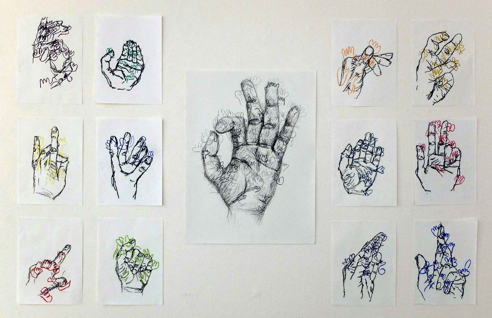 
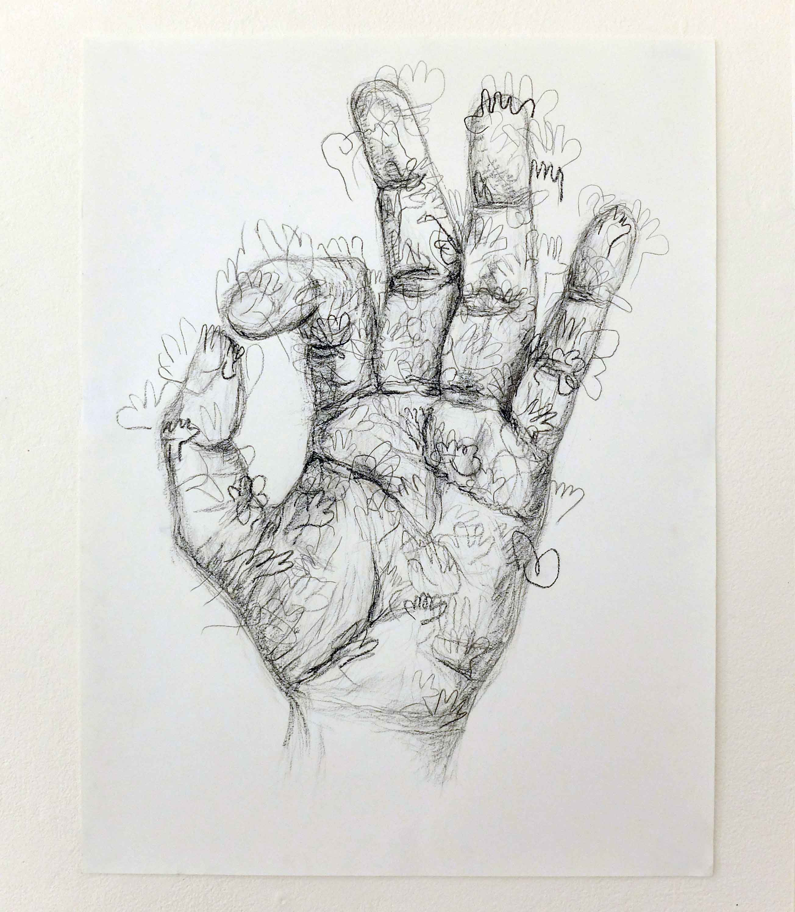

  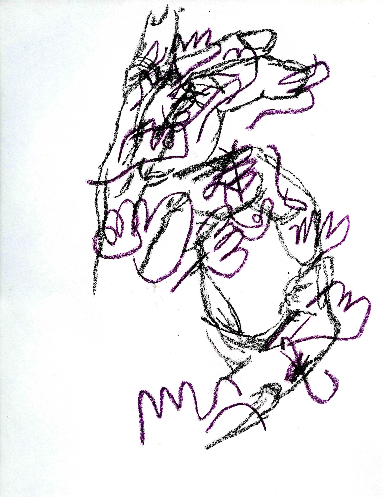
  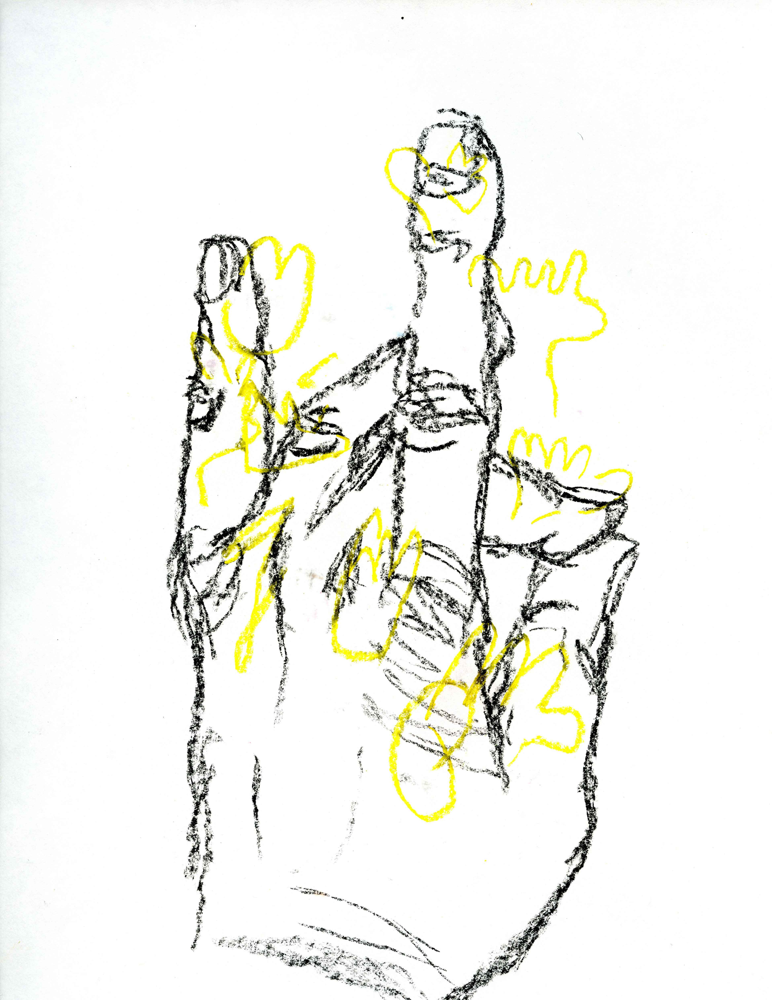

