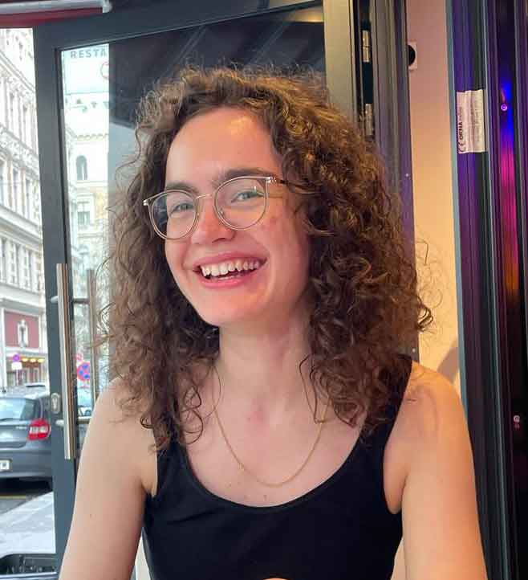

I am a first-year PhD student with the Vogels group at [IST Austria](https://ist.ac.at/de/home/){:target="_blank"}, currently investigating functional roles of plasticity rules for learning and memory in spiking neural networks. Prior to joining ISTA to complete my masters thesis, I studied and worked at the Bernstein Center for Computational Neuroscience in Berlin. My current interest are meta-plasticity, dynamical systems and..

**News**

16/08/24 My poster abstract was accepted to the Bernstein Conference 2024. See you in Frankfurt!

06/07/24 I officially affiliated with the Vogels group. Excited for the next few years!
